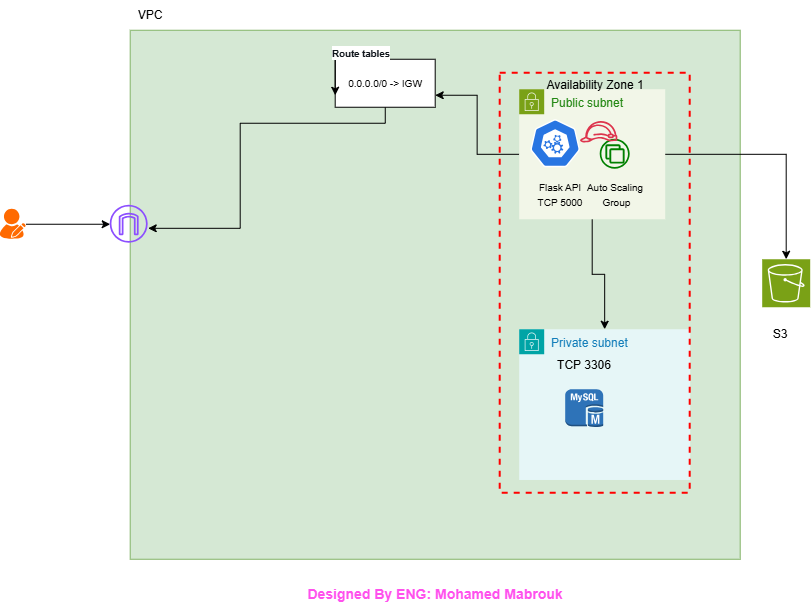

# Employee Job Application Cloud System

A cloud-based employee job application system built with **Flask, MySQL, Amazon RDS, Amazon S3, AWS IAM, and Amazon EC2**.

The application allows users to submit their personal information, photo, CV, and an optional introduction video.

The project demonstrates how a web application can use AWS managed services for database storage and object/file storage.

---

## Architecture



### Current Architecture

```text
                         Internet
                            │
                            ▼
                     ┌──────────────┐
                     │   Browser    │
                     └──────┬───────┘
                            │
                       HTTP :5000
                            │
                            ▼
                  ┌──────────────────┐
                  │       EC2        │
                  │                  │
                  │  Flask / Python  │
                  │     + Boto3      │
                  └──────┬─────┬─────┘
                         │     │
                  SQL    │     │ Presigned URL
                         │     │
                         ▼     ▼
                  ┌─────────┐ ┌─────────┐
                  │   RDS   │ │   S3    │
                  │  MySQL  │ │ Bucket  │
                  └─────────┘ └────┬────┘
                                    ▲
                                    │
                             Direct Upload
                                    │
                              ┌─────┴─────┐
                              │  Browser  │
                              └───────────┘
```

---

## How the Application Works

### 1. User opens the application

The browser sends a request to the Flask application running on EC2.

```text
Browser → EC2 → Flask
```

### 2. User submits an application

The frontend sends a request to:

```text
POST /api/upload-url
```

The Flask application uses **Boto3** and the EC2 IAM Role to generate a temporary S3 Presigned URL.

### 3. Browser uploads files to S3

The browser uses the Presigned URL to upload the file directly to Amazon S3.


The file does not need to pass through the Flask server.

### 4. Application data is stored in RDS

After the files are uploaded, the browser sends the file keys and applicant information to Flask.

Flask stores the application data in Amazon RDS MySQL.


### Important

Amazon RDS does **not** communicate directly with Amazon S3 in this architecture.

The communication is:

```text
EC2 → RDS
EC2 → S3
Browser → S3
```

---

## Technology Stack

### Application

* Python
* Flask
* Boto3
* MySQL Connector

---

## Project Structure

```text
employee-job-application-cloud-system/
│
├── app/
│   ├── app.py
│   ├── requirements.txt
│   ├── static/
│   │   ├── app.js
│   │   └── style.css
│   └── templates/
│       └── index.html
│
├── database/
│   └── schema.sql
│
├── scripts/
│   └── user-data.sh
│
├── architecture.png
├── README.md
└── .gitignore
```

---

## Environment Variables

The application reads configuration from environment variables that I define them.

**You should put true values**

```bash
export DB_HOST="your-rds-endpoint"
export DB_PORT="3306"
export DB_NAME="job_applications"
export DB_USER="admin"
export DB_PASSWORD="your-password"
export S3_BUCKET="your-bucket-name"
export AWS_REGION="us-east-1"
```

---

## AWS IAM Role

The EC2 instance uses an IAM Role to access Amazon S3.


## S3 Presigned URL

The application generates temporary upload URLs using Boto3.

The basic flow is:

```text
Browser
   │
   │ Request upload URL
   ▼
EC2 / Flask
   │
   │ Boto3
   ▼
Amazon S3
   │
   │ Presigned URL
   ▼
Browser
   │
   │ PUT file
   ▼
Amazon S3
```

This allows the browser to upload files directly to S3 without exposing AWS credentials.

---

### Clone Repository

```bash
git clone https://github.com/Mohamed-Mabrouk-Cloud-projects/project_2
cd employee-job-application-cloud-system
```

### Create Virtual Environment

```bash
python3 -m venv venv
source venv/bin/activate
```

### Install Dependencies

```bash
pip install -r app/requirements.txt
```

### Run Application

```bash
cd app
python app.py
```

The application will be available at:

```text
http://Public_IP:5000
```